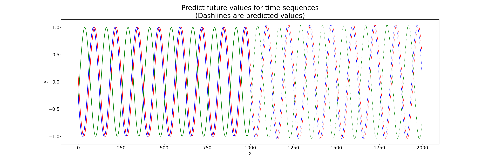
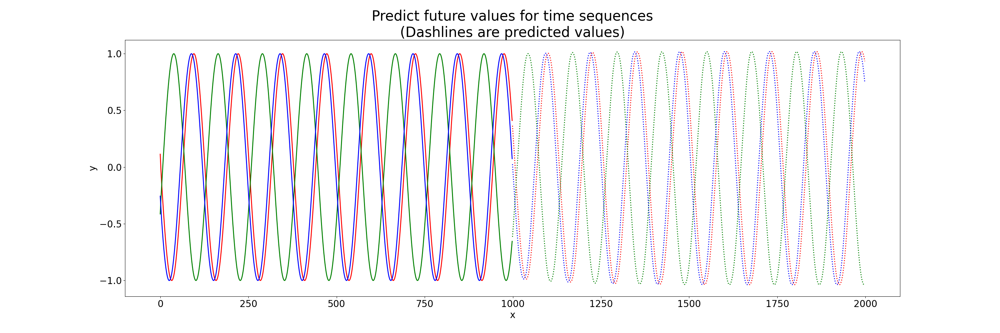
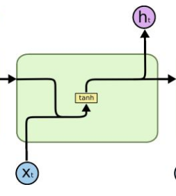

# RNN, LSTM and GRU implementations using PyTorch for Time Sequence Prediction
This is a toy example for learning both RNNs and time sequence prediction. Two Cell units(RNNCell \ LSTMCell \ GRUCell) are used in this example to learn some sine wave signals starting at different phases. After learning the sine waves, the network tries to predict the signal values in the future. We compare our RNN/LSTM/GRU implementations with pytorch's and shown results in the picture below.

This eductional RNN, LSTM and GRU implementations heavily borrows from the Pytorch example for time sequence prediction that can be found here: https://github.com/pytorch/examples/tree/master/time_sequence_prediction


This repo contains implementations of:

  * Basic GRUCell
  * LSTMCell
  * RNNCell
  * Time Sequence Prediction
  
To do:
* [Basic SRUCell](https://github.com/asappresearch/sru/blob/3.0.0-dev/sru/modules.py)


## Usage

```
python train.py --arch=$ARCH() --imp=$Implementation
```
* ```--arch```: Model Architecture. Allowed choices are ```rnn```, ```lstm```, ```gru```. 
* ```--imp```: Implementation type. Allowed choices are ```torch```, ```custom```. You can compare the results of our implementation with pytorch's.


Examples:
* using PyTorch GRU Implementation
```
python train.py --arch="gru" --imp="torch"
```

* using our GRU Implementation
```
python train.py --arch="gru" --imp="custom"
```

## Results
The initial signal and the predicted results are shown in the image. We first give some initial signals (full line). The network will  subsequently give some predicted results (dash line). It can be concluded that the network can generate new sine waves.

* PyTorch GRU:


* Our GRU Implementation:



## Example of LSTM Cell and GRU Cell

This picture is from:
> https://towardsdatascience.com/illustrated-guide-to-lstms-and-gru-s-a-step-by-step-explanation-44e9eb85bf21

Example of RNNCell



## Dependencies
* ```pytorch```
* ```numpy```